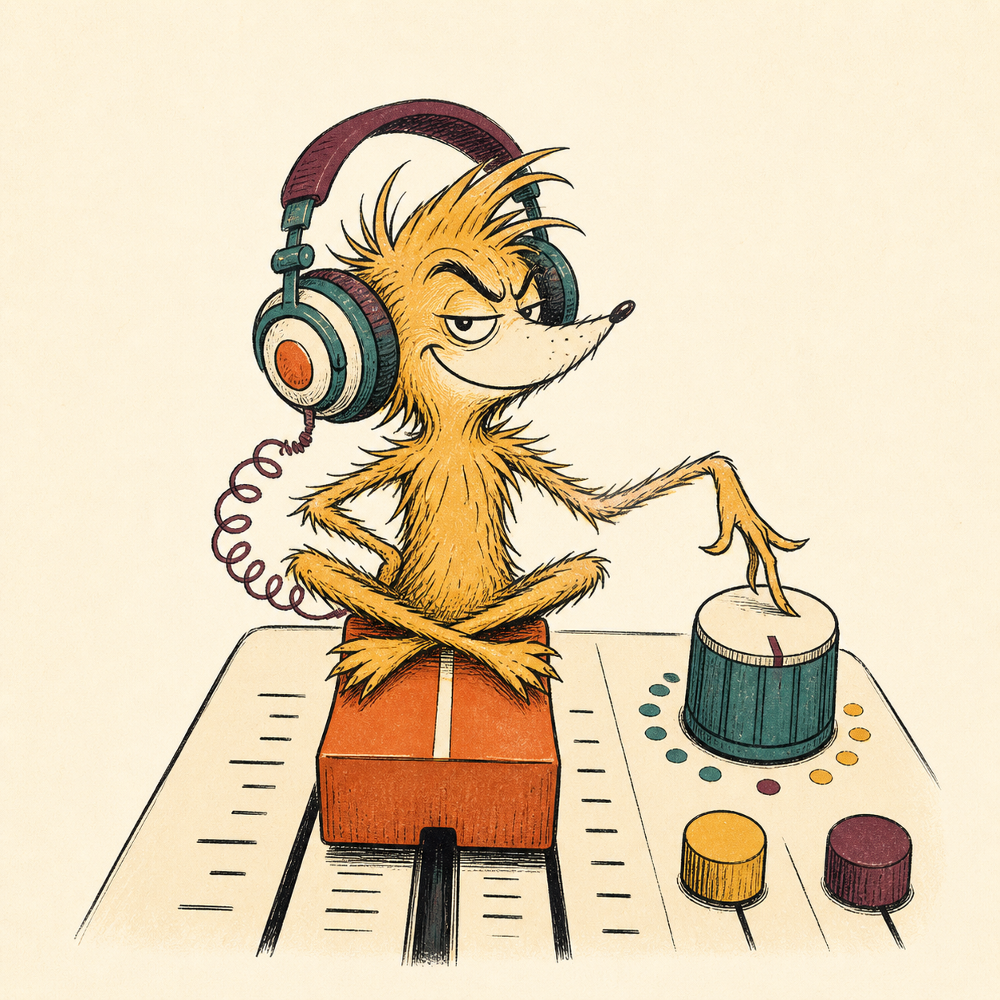
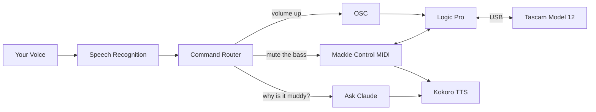

# Snarky

<p align="center">
  
</p>

Your studio assistant who actually listens. Talk to your DAW
while your hands are busy doing something useful.

Snarky sits between you and Logic Pro, translating whatever you
mumble into actual mixer commands. Ask a dumb question about
frequencies, get a real answer. Forget which track the kick is
on, just say "kick." Snarky knows.

## What You Need

- Tascam Model 12 (USB, DAW control mode)
- A Mac that isn't from 2015
- Logic Pro
- An instrument and something to say

## How It Works



Commands like "record track 8" get parsed deterministically.
No LLM in the loop, no latency, no hallucinated fader moves.

Questions like "why does the bass sound muddy?" route to Claude
with your actual session state as context.

## Get Going

```sh
mise install      # erlang, elixir, python
mise setup        # elixir deps, python deps, environment check
mise start        # launch snarky
```

Pick up your instrument. Talk.

```sh
mise tts:test     # hear kokoro say "snarky is ready"
mise check        # compile strict, format, test
mise test         # just tests
mise fmt          # format code
```

## Tell Snarky What To Do

**Transport:** record, stop, play, pause, rewind, undo, redo

**Tracks:** "mute track 3", "solo the bass", "arm drums"

**Mixing:** "volume up track 1", "pan track 2 left"

**Effects:** "add reverb to track 3", "remove delay from track 5"

**Session:** "set tempo to 120", "loop bar 4 to 12", "save", "bounce"

**Questions:** "why does the bass sound muddy?", "what frequency is clashing?"

Track aliases map names to numbers. "the bass" means track 2
because you said so in `config/config.exs`.

## Configuration

`config/config.exs` controls everything:

- Track aliases ("guitar" = 1, "drums" = 5, whatever you want)
- TTS engine (`:kokoro` or `:say` if you like robots)
- Listening mode (`:always` or `:wake_word`)
- Wake word (default: "hey snarky")
- Audio device (finds your mic by name, survives unplugging)

## Architecture

Elixir/OTP supervision tree. Speech recognition runs in-process
via Bumblebee. Silero VAD gates the recognizer so it only burns
cycles when you're actually talking. Mackie Control protocol
over virtual MIDI for bidirectional DAW communication. Kokoro
neural TTS through mlx-audio on Apple Silicon.

The full architecture is in [docs/architecture.md](docs/architecture.md).
