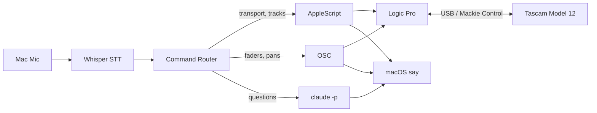

# Snarky

Voice-controlled studio assistant for Tascam Model 12 and Logic Pro,
built in Elixir. Speak commands while playing.

## Hardware

- Tascam Model 12 (USB to Mac, DAW control mode)
- Benson tube amp
- Behringer mic
- Mac with built-in mic (for voice commands)

## Architecture



Transport and track commands are parsed deterministically.
Mixer operations go through OSC. Engineering questions like
"why is the bass muddy?" route to Claude via your Max subscription.

## Requirements

- Elixir 1.19+
- whisper-cpp
- ffmpeg
- Logic Pro with OSC enabled
- Tascam Model 12 connected via USB

## Setup

```sh
mise install
mix setup
mix snarky.setup
```

## Usage

```sh
mix snarky
```

Then pick up your instrument and talk.

## Voice Commands

Transport: record, stop, play, pause, rewind, undo, redo

Tracks: "mute track 3", "solo the bass", "arm drums"

Mixing: "volume up track 1", "pan track 2 left"

Effects: "add reverb to track 3", "remove delay from track 5"

Session: "set tempo to 120", "loop bar 4 to bar 12", "save", "bounce"

Questions: "why does the bass sound muddy?", "what frequency is clashing?"

Track aliases are configurable in `config/config.exs`.

## Configuration

Edit `config/config.exs` to set:

- Track aliases (map names like "guitar" to track numbers)
- Whisper model path and binary location
- OSC host and port
- Listening mode (`:always` or `:wake_word`)
- Wake word (default: "hey snarky")
- Voice and speech rate for spoken feedback
