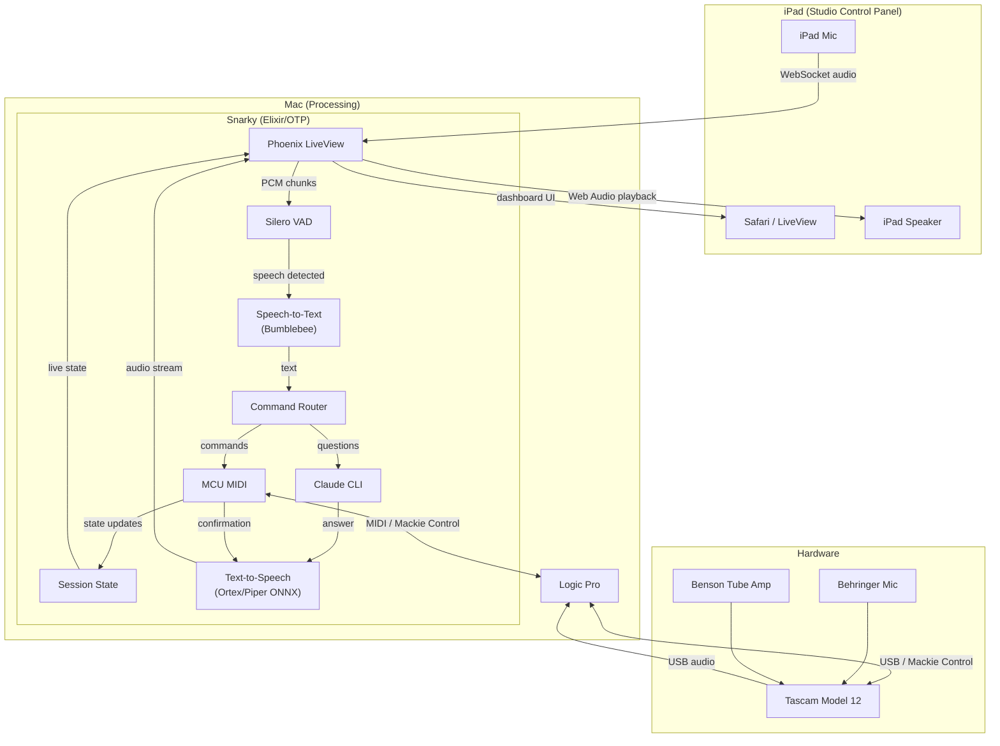
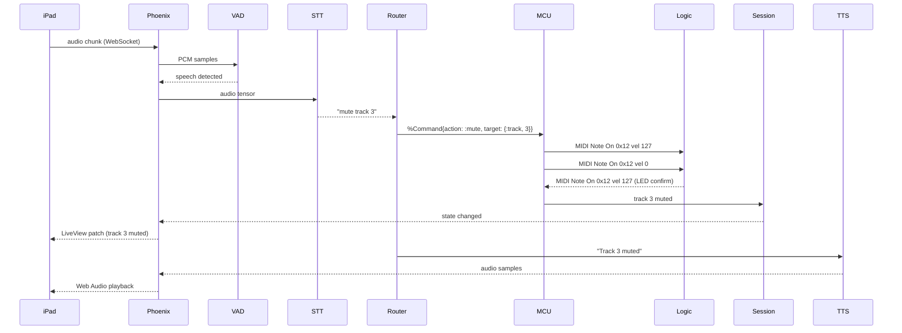
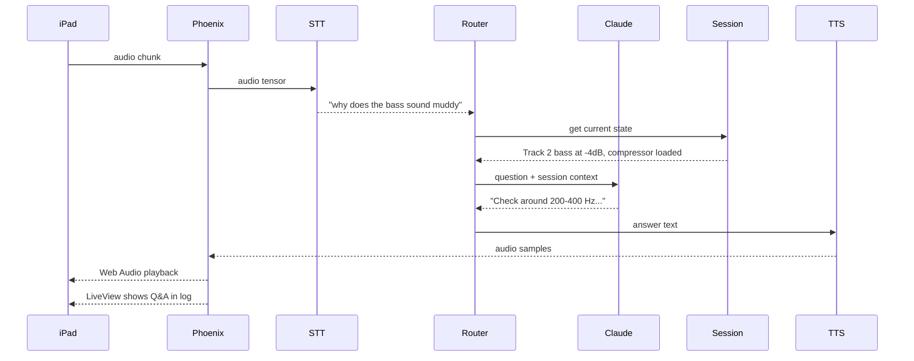
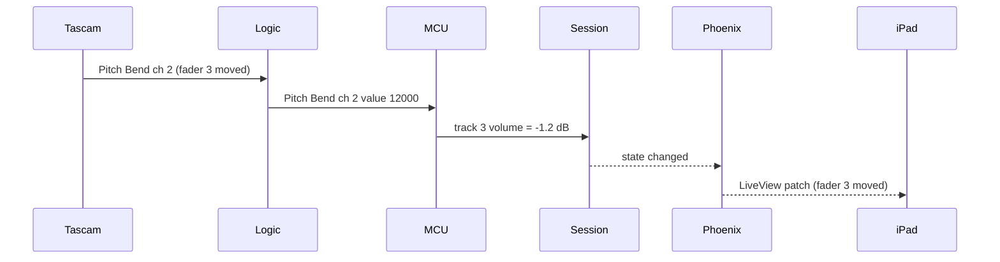
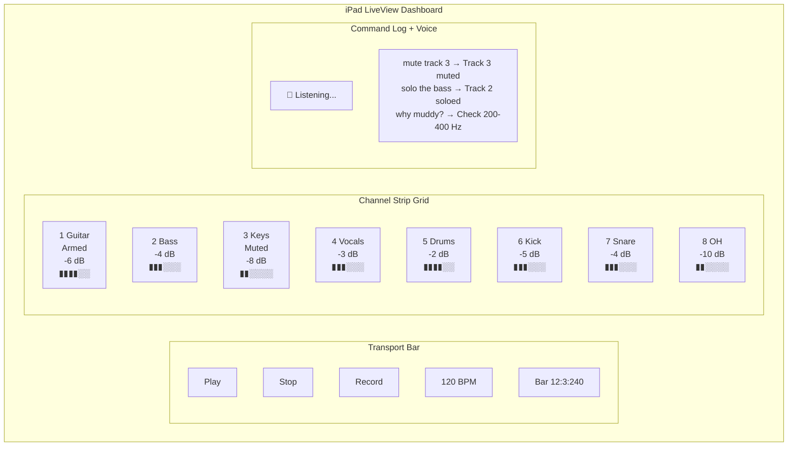
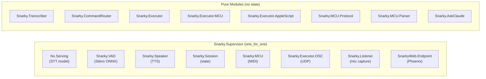
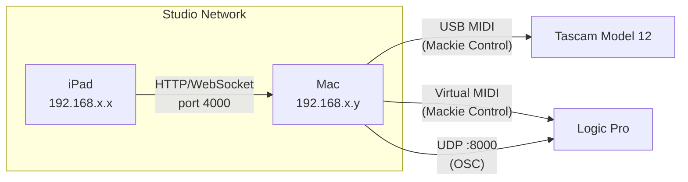

# Snarky System Architecture

## Overview

Snarky is an Elixir/OTP application that runs on a Mac alongside
Logic Pro. An iPad serves as the studio control panel. The Mac
does all processing. The iPad is the eyes, ears, and mouth.

## Data Flow: Voice Command

A musician speaks a command into the iPad while playing.

## Data Flow: Engineering Question

A musician asks a troubleshooting question.

## Data Flow: Tascam Physical Control

Someone moves a fader on the Tascam. Snarky sees it.

## iPad Dashboard Layout

## Component Architecture

## Network Topology

## Tech Stack

| Layer | Technology |
|-------|-----------|
| Runtime | Elixir/OTP on BEAM |
| Web | Phoenix LiveView |
| STT | Bumblebee + distil-whisper (EXLA) |
| VAD | Silero via Ortex (ONNX) |
| TTS | Piper via Ortex (ONNX) or macOS say |
| DAW control | Mackie Control protocol via midiex |
| Mixer control | OSC via ex_osc |
| Fallback control | AppleScript via osascript |
| AI assistant | Claude CLI (Max subscription) |
| Audio capture | ffmpeg (local mic) or WebSocket (iPad mic) |
| Audio playback | Web Audio API (iPad) or macOS say (local) |
